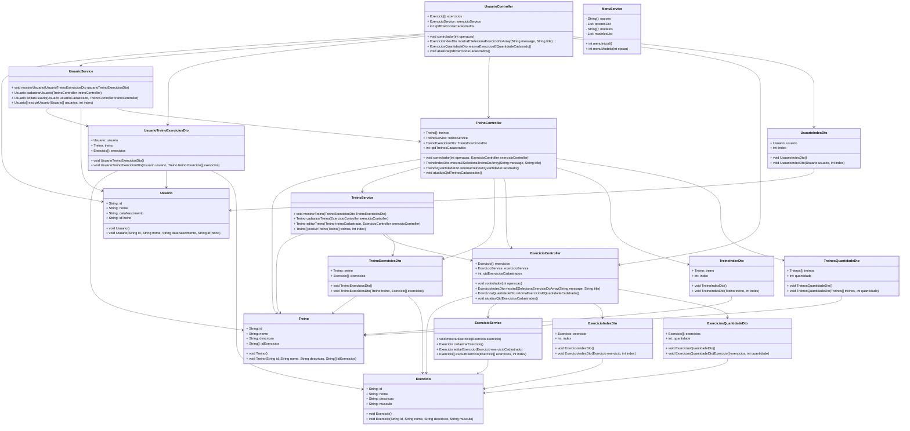

```mermaid
classDiagram
  ExercicioIndexDto --> Exercicio
  ExerciciosQuantidadeDto --> Exercicio
  TreinoExerciciosDto --> Treino
  TreinoExerciciosDto --> Exercicio
  TreinoIndexDto --> Treino
  TreinosQuantidadeDto --> Treino
  UsuarioIndexDto --> Usuario
  UsuarioTreinoExerciciosDto --> Treino
  UsuarioTreinoExerciciosDto --> Usuario
  UsuarioTreinoExerciciosDto --> Exercicio

  UsuarioController --> Usuario
  UsuarioController --> UsuarioService
  UsuarioController --> UsuarioTreinoExerciciosDto
  UsuarioController --> TreinoController
  UsuarioController --> ExercicioController
  UsuarioController --> UsuarioIndexDto
  TreinoController --> Treino
  TreinoController --> TreinoService
  TreinoController --> TreinoExerciciosDto
  TreinoController --> ExercicioController
  TreinoController --> TreinoIndexDto
  TreinoController --> TreinosQuantidadeDto
  ExercicioController --> Exercicio
  ExercicioController --> ExercicioService
  ExercicioController --> ExercicioIndexDto
  ExercicioController --> ExerciciosQuantidadeDto

  TreinoService --> Treino
  TreinoService --> ExercicioController
  TreinoService --> TreinoExerciciosDto
  ExercicioService --> Exercicio
  UsuarioService --> UsuarioTreinoExerciciosDto
  UsuarioService --> Usuario
  UsuarioService --> TreinoController

  class Usuario {
    + String: id
    + String: nome
    + String: dataNascimento
    + String: idTreino

    + void Usuario()
    + void Usuario(String id, String nome, String dataNascimento, String idTreino)
  }

  class Treino {
    + String: id
    + String: nome
    + String: descricao
    + String[]: idExercicios

    + void Treino()
    + void Treino(String id, String nome, String descricao, String[] idExercicios)
  }

  class Exercicio {
    + String: id
    + String: nome
    + String: descricao
    + String: musculo

    + void Exercicio()
    + void Exercicio(String id, String nome, String descricao, String musculo)
  }

  class ExercicioIndexDto {
    + Exercicio: exercicio
    + int: index

    + void ExercicioIndexDto()
    + void ExercicioIndexDto(Exercicio exercicio, int index)
  }

  class ExerciciosQuantidadeDto {
    + Exercicio[]: exercicios
    + int: quantidade

    + void ExerciciosQuantidadeDto()
    + void ExerciciosQuantidadeDto(Exercicio[] exercicios, int quantidade)
  }

  class TreinoExerciciosDto {
    + Treino: treino
    + Exercicio[]: exercicios

    + void TreinoExerciciosDto()
    + void TreinoExerciciosDto(Treino treino, Exercicio[] exercicios)
  }

  class TreinoIndexDto {
    + Treino: treino
    + int: index

    + void TreinoIndexDto()
    + void TreinoIndexDto(Treino treino, int index)
  }

  class TreinosQuantidadeDto {
    + Treinos[]: treinos
    + int: quantidade

    + void TreinosQuantidadeDto()
    + void TreinosQuantidadeDto(Treinos[] treinos, int quantidade)
  }

  class UsuarioIndexDto {
    + Usuario: usuario
    + int: index

    + void UsuarioIndexDto()
    + void UsuarioIndexDto(Usuario usuario, int index)
  }

  class UsuarioTreinoExerciciosDto {

    + Usuario: usuario
    + Treino: treino
    + Exercicio[]: exercicios

    + void UsuarioTreinoExerciciosDto()
    + void UsuarioTreinoExerciciosDto(Usuario usuario, Treino treino Exercicio[] exercicios)
  }

  class UsuarioController {
    + Exercicio[]: exercicios
    + ExercicioService: exercicioService
    + int: qtdExerciciosCadastrados

    + void controlador(int operacao)
    + ExercicioIndexDto mostraESelecionaExercicioDoArray(String message, String title):
    + ExerciciosQuantidadeDto retornaExerciciosEQuantidadeCadstrado()
    + void atualizaQtdExerciciosCadastrados()
  }

  class TreinoController {
    + Treino[]: treinos
    + TreinoService: treinoService
    + TreinoExerciciosDto: TreinoExerciciosDto
    + int: qtdTreinosCadastrados

    + void controlador(int operacao, ExercicioController exercicioController)
    + TreinoIndexDto: mostraESelecionaTreinoDoArray(String message, String title)
    + TreinosQuantidadeDto retornaTreinosEQuantidadeCadstrado()
    + void atualizaQtdTreinosCadastrados()
  }

  class ExercicioController {
    + Exercicio[]: exercicios
    + ExercicioService: exercicioService
    + int: qtdExerciciosCadastrados

    + void controlador(int operacao)
    + ExercicioIndexDto mostraESelecionaExercicioDoArray(String message, String title)
    + ExerciciosQuantidadeDto retornaExerciciosEQuantidadeCadstrado()
    + void atualizaQtdExerciciosCadastrados()
  }

  class MenuService {
    - String[]: opcoes
    - List<String>: opcoesList
    - String[]: modelos
    - List<String>: modelosList

    + int menuInicial()
    + int menuModelo(int opcao)
  }

  class TreinoService {
    + void mostrarTreino(TreinoExerciciosDto TreinoExerciciosDto)
    + Treino cadastrarTreino(ExercicioController exercicioController)
    + Treino editarTreino(Treino treinoCadastrado, ExercicioController exercicioController)
    + Treino[] excluirTreino(Treino[] treinos, int index)
  }

  class ExercicioService {
    + void mostrarExercicio(Exercicio exercicio)
    + Exercicio cadastrarExercicio()
    + Exercicio editarExercicio(Exercicio exercicioCadastrado)
    + Exercicio[] excluirExercicio(Exercicio[] exercicios, int index)
  }

  class UsuarioService {
    + void mostrarUsuario(UsuarioTreinoExerciciosDto usuarioTreinoExerciciosDto)
    + Usuario cadastrarUsuario(TreinoController treinoController)
    + Usuario editarUsuario(Usuario usuarioCadastrado, TreinoController treinoController)
    + Usuario[] excluirUsuario(Usuario[] usuarios, int index)
  }
```
